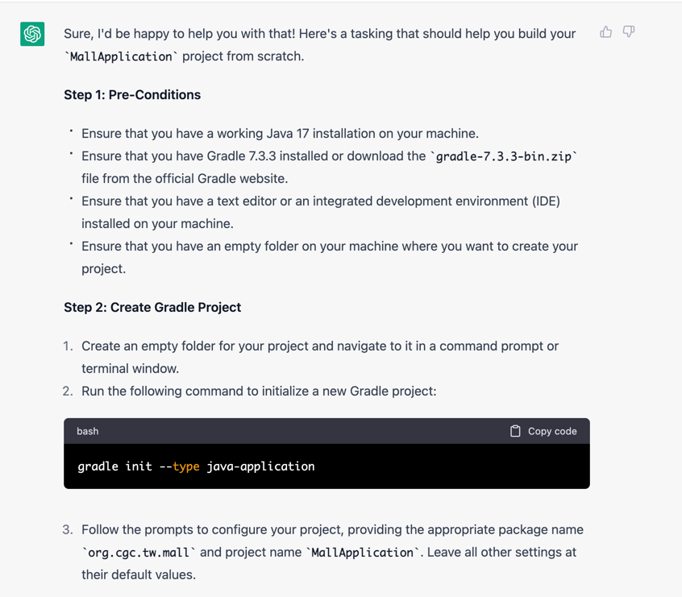
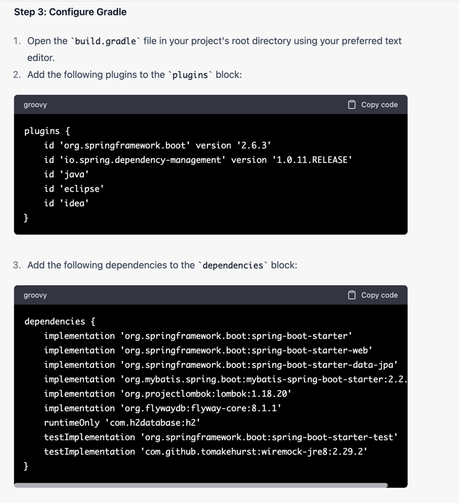
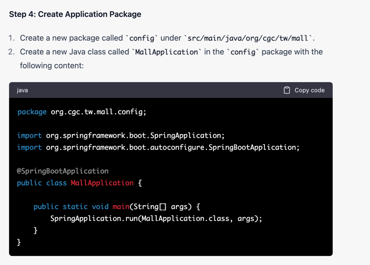
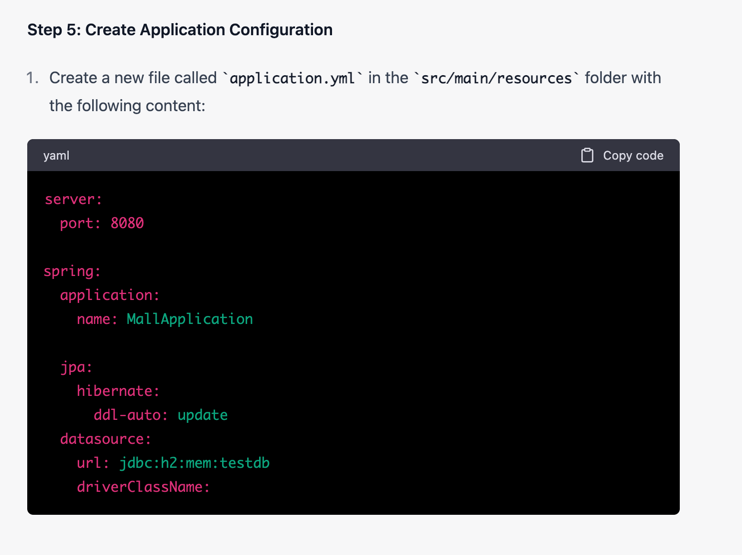
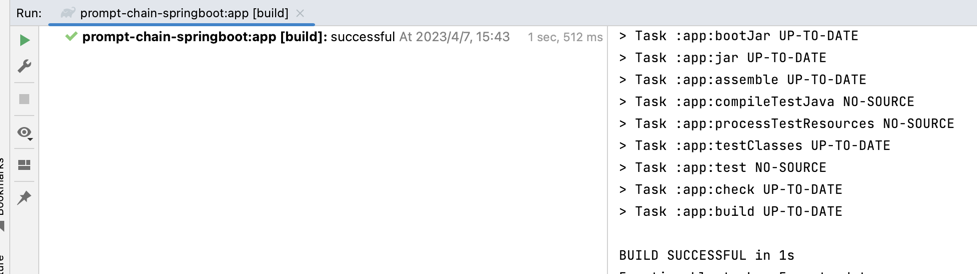
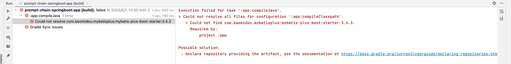
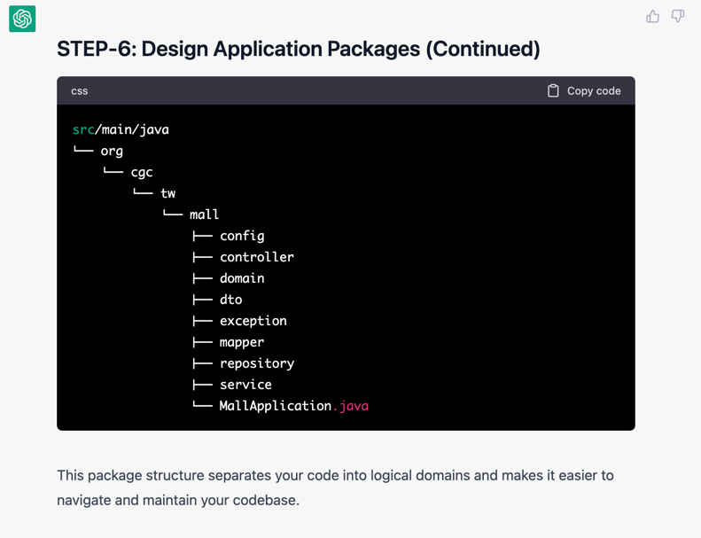

## ask advice about how to build java project

### dev
```text
hi GPT, i want build a scratch java project `MallApplication` from empty folder, 

could you give me a `guideline` how to do that?

`Package` is 
`org.cgc.tw.mall` 

`Tech Stack` are
* Java17
* Gradle wrapper gradle-7.3.3-bin.zip
* Lombok
* SpringBoot
* SpringBoot Starter
* SpringBoot Starter Web
* SpringBoot Starter Data JPA
* mybatis-spring-boot-starter
* flyway-core
* h2 database
* spring-boot-starter-test
* wiremock

please follow:
*. please use `STEP-{number}` to indicate what i need to do in each step. 
*. please use `ASSUMPTION` to indicate what you assumed when making decisions.
*. please help design application packages
*. pls help generate Application class and application.yml only. 

```

### ChatGPT






### compile result



### findings

* build.gradle
> mybatis plus not support jdk17

> 解锁神秘交互

> only 很关键