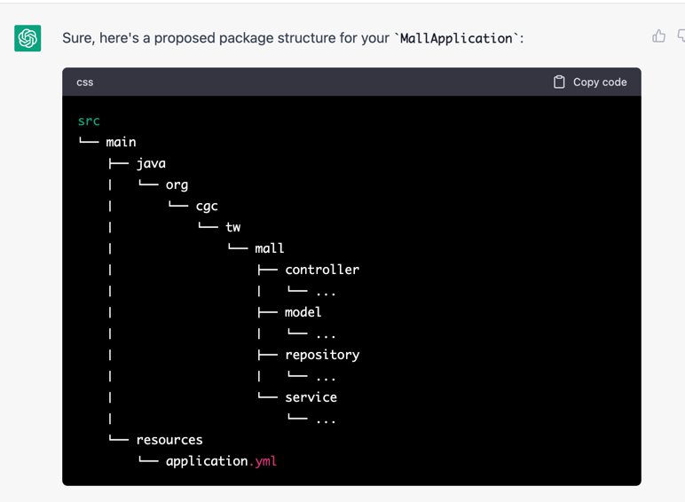
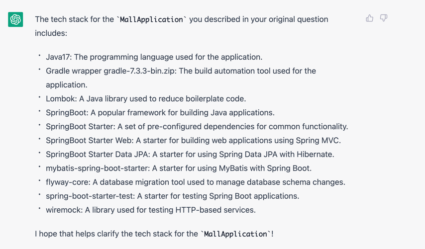
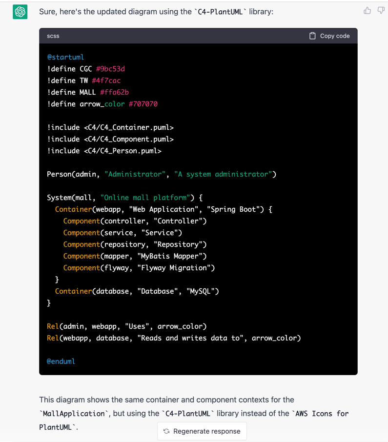
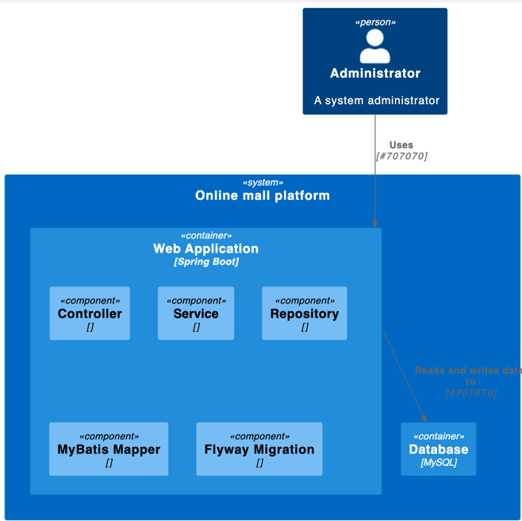
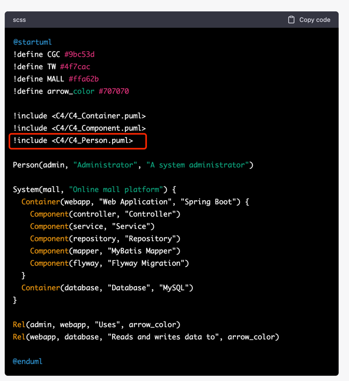

## ask GPT generate c4 modeling

### Dev

```text
what's structure for `MallApplication`
what's `tech stack` for  `MallApplication` 
```

### ChatGPT



### Dev
```text
please use `plantuml-stdlib/C4-PlantUML `  draw c4 modeling for  `MallApplication`
```

### ChatGPT



### result
> /c3.puml



### findings



