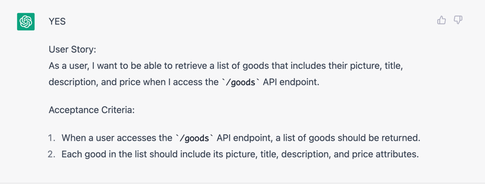
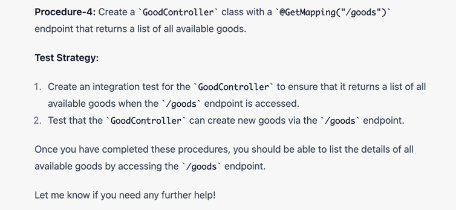

## US到工序prompting

### dev
```text
now i got a user story - `US1` 
description: 
   user can list good details, `good` contains `picture`, `title`, `description` and `price` attributes
acceptance criteria:
1. should return good list when access api `/goods`
    
if you understood, please say `YES` and show the the story definition    
```

###  response from ChatGPT



### dev
```text

could you design implement strategy for `US1`.
* you can indicate `Procedure-{NUMBER}` in each step
* each Procedure should include test strategy

```

### chatgpt




