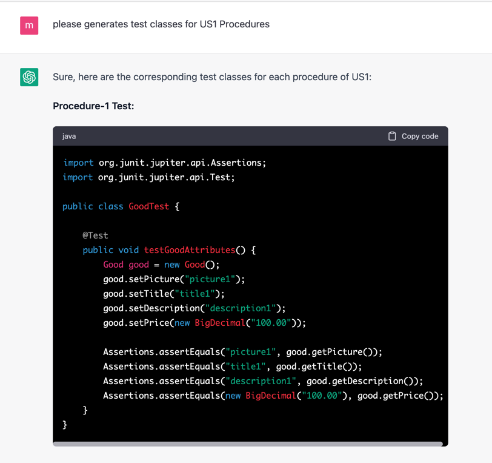
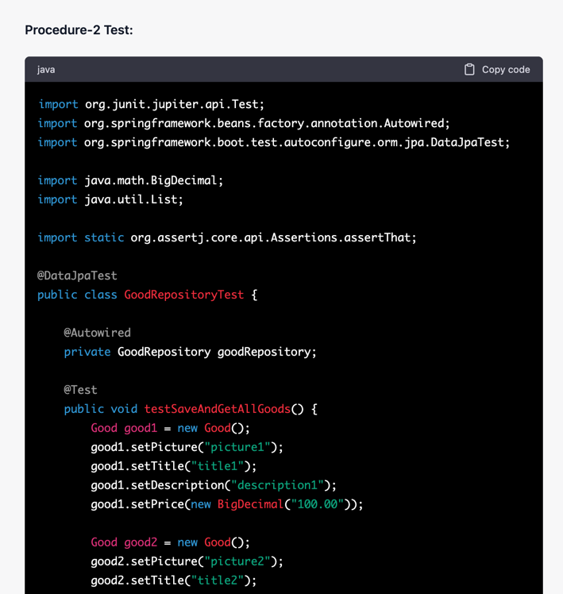
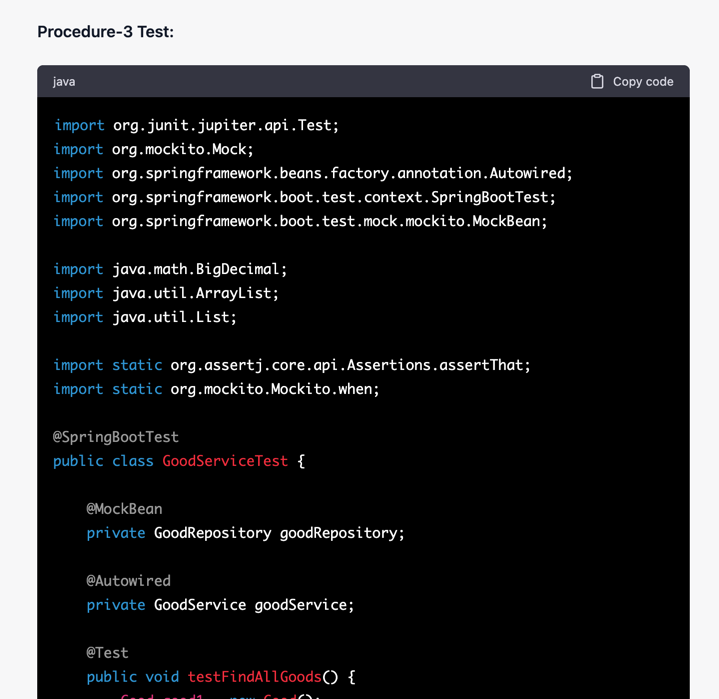
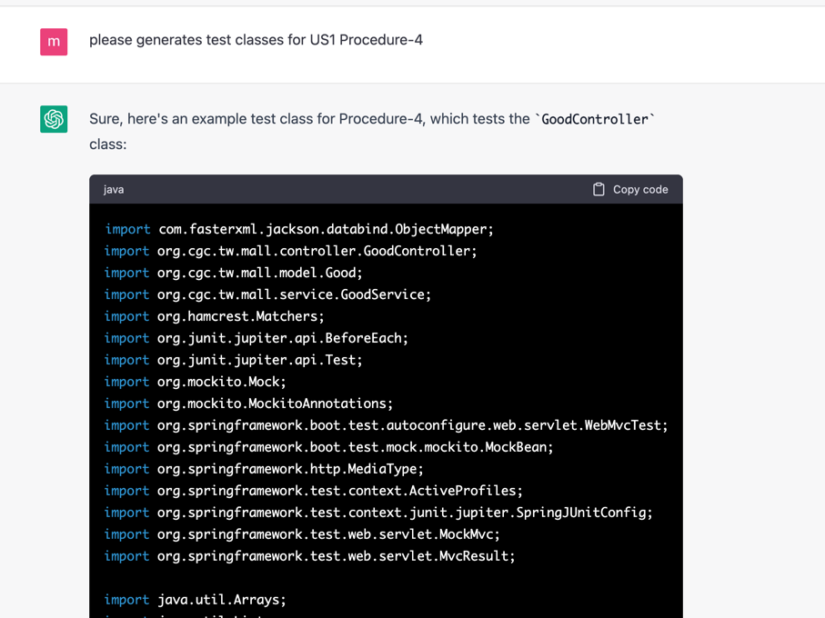

## testcase prompting

### dev
```text
please generates test classes for US1 Procedures
``` 

### chatgpt





### dev: rollback and reproduce
```text

here's an implementation strategy for US1 with test strategy:


Procedure-1: Create a Good entity with attributes picture, title, description, and price.

Test Strategy:

Create a unit test for the Good entity to ensure that it is created with the correct attributes.
Test that the getters and setters for each attribute are working as expected.
Procedure-2: Create a GoodRepository interface that extends JpaRepository<Good, Long>.

Test Strategy:

Create a unit test for the GoodRepository to ensure that it can retrieve all available goods.
Test that the GoodRepository can save new goods.
Procedure-3: Create a GoodService class that uses the GoodRepository to retrieve all available goods.

Test Strategy:

Create a unit test for the GoodService to ensure that it can retrieve all available goods.
Test that the GoodService can save new goods.
Procedure-4: Create a GoodController class with a @GetMapping("/goods") endpoint that returns a list of all available goods.

Test Strategy:

Create an integration test for the GoodController to ensure that it returns a list of all available goods when the /goods endpoint is accessed.
Test that the GoodController can create new goods via the /goods endpoint.

Once you have completed these procedures, you should be able to list the details 
of all available goods by accessing the /goods endpoint. if you understood, pls say "YES"

```