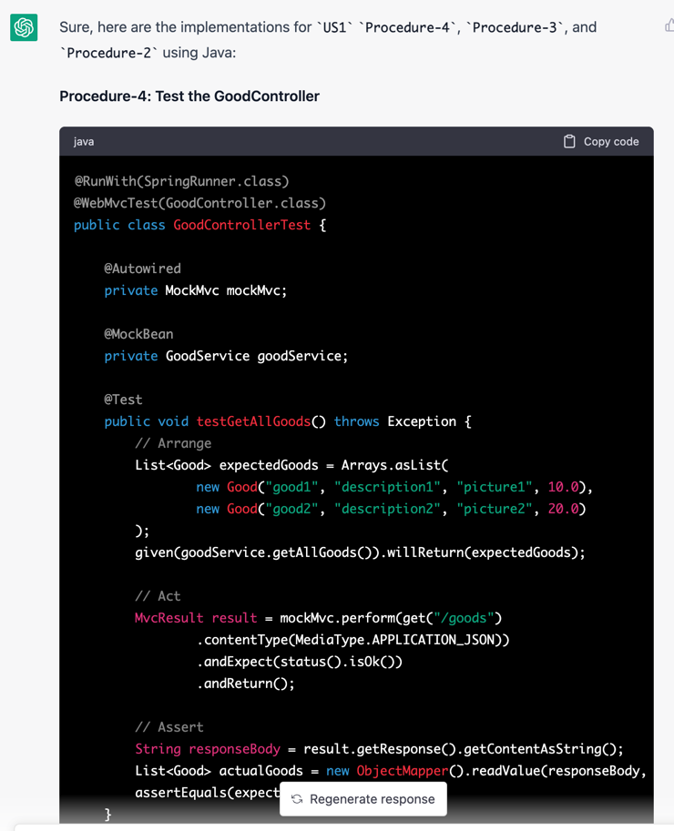
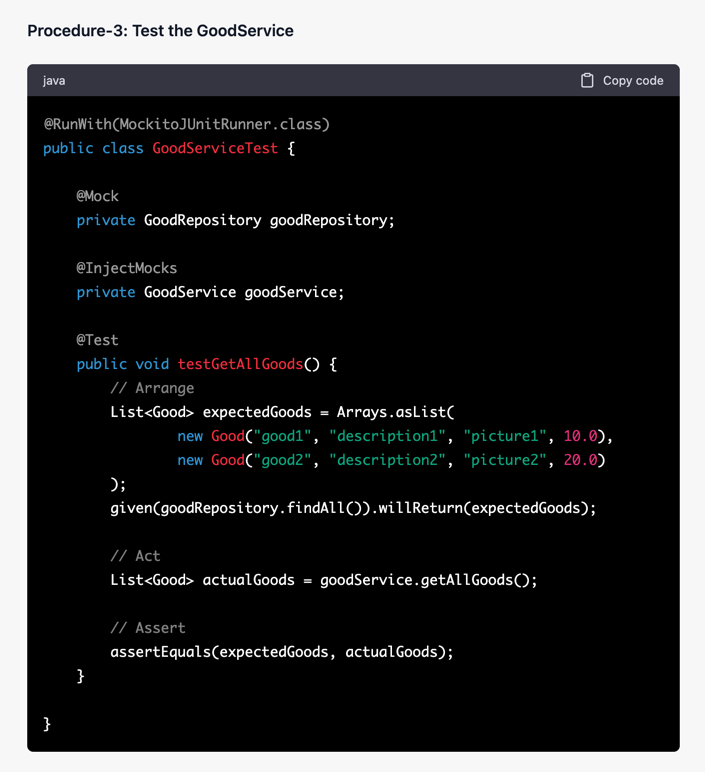
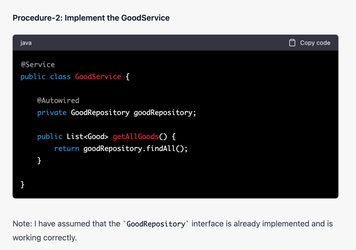
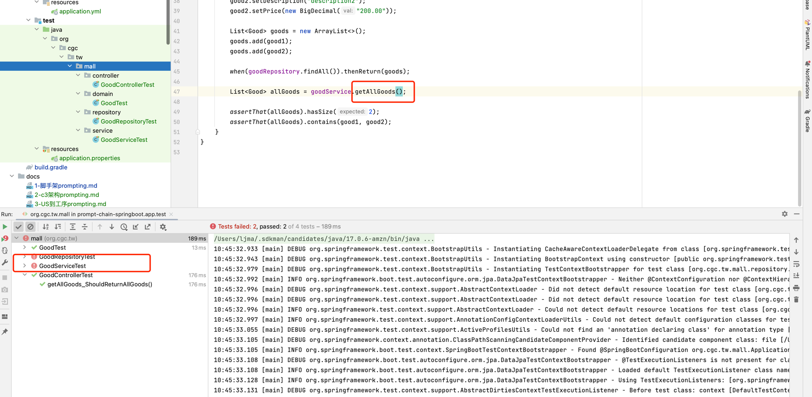
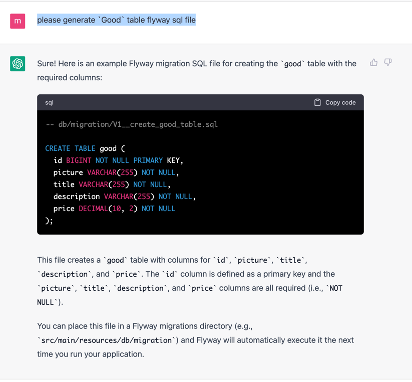
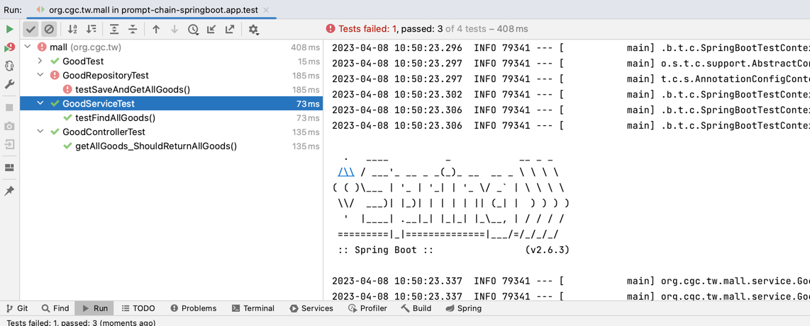

## testcase prompting

### dev
```text
please implement all related classes to pass tests
```

### chatgpt






### findings

第一次测试结果， 构造函数不一致，测试不通过


### dev 纠错

```text
please generate `Good` table flyway sql file
```


> after fix




```text
手工修正good service错误，改掉assertion
```
all test passed!


application start successfully!


