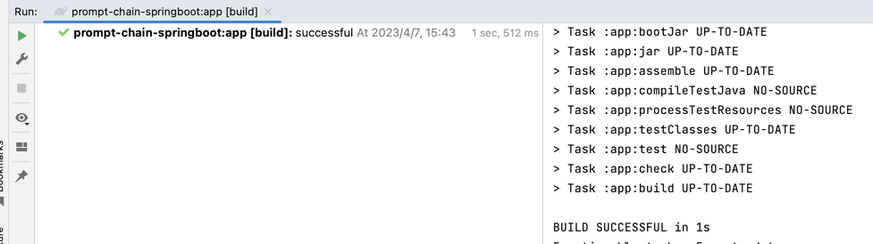
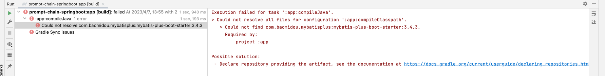
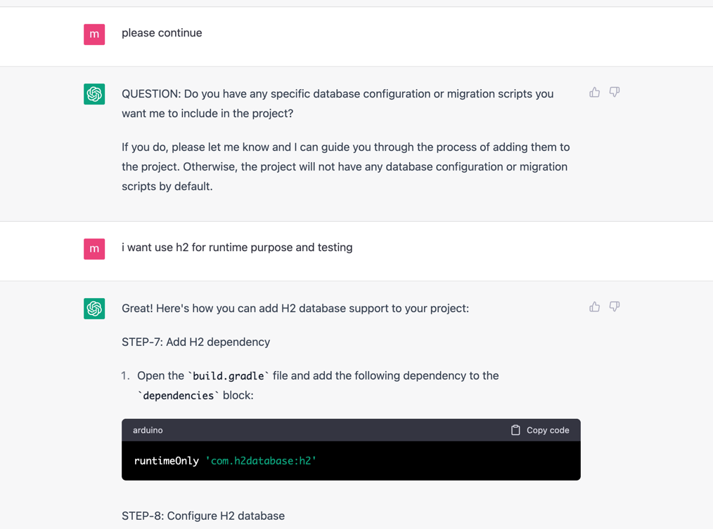

## ask advice about how to build java project

### dev
```text
hi GPT, i want build a scratch java project from empty folder, could you give me a guideline how to do that?
my domain is `org.cgc.tw.mall`, 
here are my preferred tech stack.
* Java17
* Gradle wrapper gradle-7.3.3-bin.zip
* Lombok
* SpringBoot
* SpringBoot Starter
* SpringBoot Starter Web
* SpringBoot Starter Data JPA
* mybatis-spring-boot-starter
* flyway-core
* spring-boot-starter-test
* wiremock
here are my additional requirements
*. please use `STEP-{number}` to indicate what i need to do in each step. 
*. please use `Pre-Condition` to indicate what i need parpare before start
*. please use `ASSUMPTION` to indicate what you assumed when making decisions.
*. please help design application packages
*. pls help generate Application class only. 
```

### ChatGPT


### compile result



### findings

* build.gradle
> mybatis plus not support jdk17

> 解锁神秘交互

