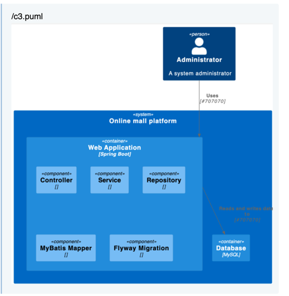

# SpringBoot Prompting Demo

原文地址： 

## 实验目标

你作为开发加入一个电子商城项目中，现在需要为该项目从零开始搭建架子,
所有生产代码必须通过ChatGPT完成 ，并完成如下功能：

1. 用户可以查看商品详情，包含了商品的图片、标题、描述、价格等信息，

期望技术栈

* Java17
* Lombok 1.18.24
* Gradlew gradle-7.2-all.zip
* SpringBoot 2.2.2.RELEASE
* SpringBoot Starter
* SpringBoot Starter Web
* SpringBoot Starter Data JPA
* mybatis-spring-boot-starter 2.1.0
* mybatis-plus-boot-starter 3.4.0
* flyway-core

测试技术栈

* spring-boot-starter-test
* wiremock

### Prompt试验记录

* [脚手架prompting](docs/1-脚手架prompting.md)
* [c3架构prompting](docs/2-c3架构prompting.md)
* [US到工序prompting](docs/3-US到工序prompting.md)
* [工序到测试用例prompting](docs/4-工序到testcase_prompting.md)
* [测试用例到生产代码prompting](docs/5-test-case到生产代码-prompting.md)

### 试验结果

> 1. 项目从0到1，有GPT 99% 完成搭建


> 2. C3应用架构图，GPT画出



> 3. 测试用例测试通过，GPT实现！


> 4. 应用启动成功，GPT实现！


### Prompt Chain SpringBoot 详细描述

```text
Prompt 1 - 构建脚手架
目的:    让GPT了解项目上下文
Input:  project name,  package info, prefer tech stack
Output:  step-by-step guideline , 构建《Context》
detail:  docs/1-脚手架prompting.md
```

```text
Prompt 2 - c3架构prompting
目的: 让GPT根据项目上下文，画出C3应用架构图
Input:  《Context》
Output:  plunt uml
detail:  docs/2-c3架构prompting.md
```

```text
Prompt 3 - US到工序prompting
目的: 让GPT根据项目上下文和用户故事，设计工序
Input:   UserStory定义, 《Context》
Output:  工序定义， Procedure 列表
detail:  docs/3-US到工序prompting.md
```

```text
Prompt 4 - 工序到测试用例prompting
目的: 让GPT根据上下文，工序和用户故事，生成测试用例
Input:   UserStory定义, 《Context》， Procedure工序列表
Output:  测试用例代码
detail:  docs/4-工序到testcase_prompting.md
```

```text
Prompt 5 - 测试用例到生产代码prompting
目的:     让GPT根据上下文，工序和用户故事，测试用例生成 产品代码
Input:   UserStory定义, 《Context》， Procedure工序列表，测试用例
Output:  产品代码
detail:  docs/5-test-case到生产代码-prompting.md
```

### 如何使用该Prompt Chain帮助快速实现项目搭建

* 【快速性】请按照Prompt 1-5的顺序，依次与GPT进行交互，进行快速构建
* 【顺序性】后续的每一步都依赖前一步帮助GPT建立的上下文和理解
* 【可回溯】如果不确定当前GPT所了解的上下文，可以使用某些指令让GPT可视化上下文
* 【可回滚】如果当前Prompt步骤不太满意，可以回滚当前Prompt或者到指定的Prompt阶段，方法在小技巧里有体现

### 小技巧

> 1. 如果GPT回答的问题，不够正确，可以点击

```text
regenerate
```

> 2. 如果GPT回答的问题不够完整, 可以补充

```text
answer not complete
```

> 3. 如何回溯GPT上下文，让GPT可视化

```text
1. 在描述结尾用：`if you understood, please say `YES` and show the the story definition`   
具体： docs/3-US到工序prompting.md

2. 对话中使用WHAT语句，比如： 
what's structure for `MallApplication`
what's `tech stack` for  `MallApplication`
具体：docs/2-c3架构prompting.md
```

> 4. 如何回滚 Prompt

```text
举例： 
问题：以该项目举例，我进行当Prompt第四阶段时，我发现GPT的第3阶段上下文发生变化和丢失，改问题会影响工序的产生。
方案：我希望gpt回滚当第二阶段。
方法：进行遗忘回滚操作 - Forget about `US1`
```


### 启发和思考

该测试验证了通过Prompt Chain可以很好的与GPT完成交互，并最终于ChatGPT一起完成软件开发工程领域的各项工作。
> 功能总结
* 脚手架创建工作
* 需求理解和拆分
* 工序设计
* 生成测试用例
* 生成生成代码

并且，在设计Prompt Chain的时候，如果瞒住以下一些原则会使得交付流程更加顺滑，提高更高的准确率
> Prompt Chain设计原则

* 快速性
* 顺序性
* 可回溯
* 可回滚
